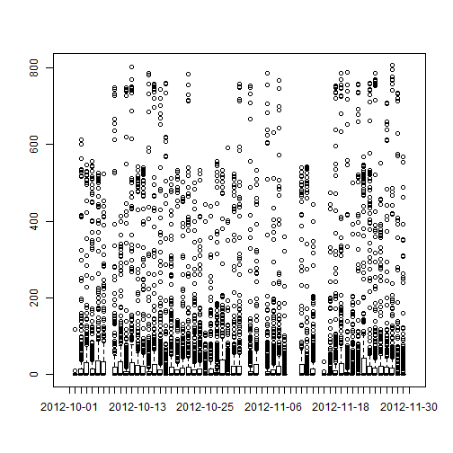
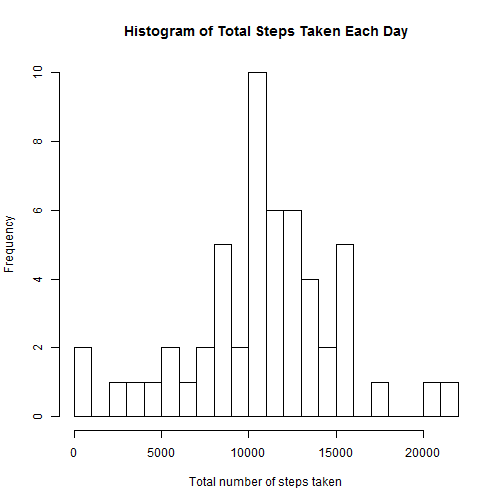
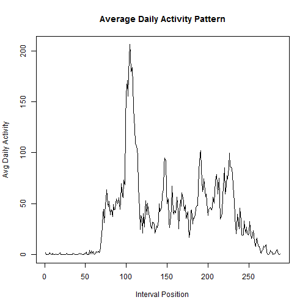

## Introduction

This is the first peer assessment for the Reproducible Research course from John Hopkins University, via coursera.  This assignment combines the tools of R programming, data analysis, knitr, git, gitHub, and other tools learned through the first five courses in this Data Science certificate 
program.    

All the R code and results will be displayed.   

Each major section in this assignment will be defined by a heading.  

## Loading and preprocessing the data

For this first section, we are to show how the raw code was imported into R for analysis and 
the steps proformed.  

The assumption is the raw csv file is in the working directory.  


```r
setwd("C:/Users/ric/RepData_PA1")
getwd() ## check working directory has been set. 
```

```
## [1] "C:/Users/ric/RepData_PA1"
```

```r
activityDataRaw <- read.csv("activity.csv")  ## read data into R dataframe. 
```
==============================  
Begin data file inspection  
==============================    

```r
str(activityDataRaw) ## inspect structure of data
```

```
## 'data.frame':	17568 obs. of  3 variables:
##  $ steps   : int  NA NA NA NA NA NA NA NA NA NA ...
##  $ date    : Factor w/ 61 levels "2012-10-01","2012-10-02",..: 1 1 1 1 1 1 1 1 1 1 ...
##  $ interval: int  0 5 10 15 20 25 30 35 40 45 ...
```

```r
summary(activityDataRaw)
```

```
##      steps               date          interval   
##  Min.   :  0.0   2012-10-01:  288   Min.   :   0  
##  1st Qu.:  0.0   2012-10-02:  288   1st Qu.: 589  
##  Median :  0.0   2012-10-03:  288   Median :1178  
##  Mean   : 37.4   2012-10-04:  288   Mean   :1178  
##  3rd Qu.: 12.0   2012-10-05:  288   3rd Qu.:1766  
##  Max.   :806.0   2012-10-06:  288   Max.   :2355  
##  NA's   :2304    (Other)   :15840
```

```r
head(activityDataRaw)  ## display first few rows of data
```

```
##   steps       date interval
## 1    NA 2012-10-01        0
## 2    NA 2012-10-01        5
## 3    NA 2012-10-01       10
## 4    NA 2012-10-01       15
## 5    NA 2012-10-01       20
## 6    NA 2012-10-01       25
```

```r
tail(activityDataRaw)  ## display last rows of data
```

```
##       steps       date interval
## 17563    NA 2012-11-30     2330
## 17564    NA 2012-11-30     2335
## 17565    NA 2012-11-30     2340
## 17566    NA 2012-11-30     2345
## 17567    NA 2012-11-30     2350
## 17568    NA 2012-11-30     2355
```

```r
sum(is.na(activityDataRaw$steps)) #  determine number of NA values (which is also seen in the summary)
```

```
## [1] 2304
```


```r
plot(activityDataRaw$date, activityDataRaw$steps)  ## quick look at two variables
```

 

This completes the preprocessing section of this assignment.  


## What is the mean total number of steps taken per day?    

In this section of the assignment, the missing values (NA) observations are removed from the dataset.   


```r
activityData <- subset(na.omit(activityDataRaw))  ## build new dataset without NA values. 
head(activityData)  ## check first few rows.  
```

```
##     steps       date interval
## 289     0 2012-10-02        0
## 290     0 2012-10-02        5
## 291     0 2012-10-02       10
## 292     0 2012-10-02       15
## 293     0 2012-10-02       20
## 294     0 2012-10-02       25
```

Earlier, it was determined that there were 2304 NA observations in the original dataset of 17,568 observations.  Therefore, an arithmetic calculation shows that 13 percent of the original dataset has been removed.  


```r
2304/17568*100
```

```
## [1] 13.11
```
===================================================================   
Will now build a histogram of the total number of steps taken each day.  
===================================================================  
Calculate the total steps taken per day: 


```r
totalSteps <- tapply(activityData$steps, activityData$date, sum)  ## find the total steps count.
head(totalSteps)  ## show some of the data
```

```
## 2012-10-01 2012-10-02 2012-10-03 2012-10-04 2012-10-05 2012-10-06 
##         NA        126      11352      12116      13294      15420
```

NA values have reappeared; therefore, the data will be sorted to move the NA values to the bottom and then removed:   


```r
totalStepsSorted <- sort(totalSteps, na.last=TRUE)  ## sort and move NA values to last
totalStepsData <- totalStepsSorted[c(1:53)]
```

The resulting data:   


```r
totalStepsData  
```

```
## 2012-11-15 2012-10-02 2012-10-25 2012-11-08 2012-11-20 2012-10-29 
##         41        126       2492       3219       4472       5018 
## 2012-11-16 2012-10-26 2012-11-29 2012-11-13 2012-11-06 2012-10-24 
##       5441       6778       7047       7336       8334       8355 
## 2012-10-21 2012-11-19 2012-10-23 2012-10-30 2012-10-10 2012-10-18 
##       8821       8841       8918       9819       9900      10056 
## 2012-10-27 2012-10-15 2012-11-28 2012-10-11 2012-10-20 2012-11-05 
##      10119      10139      10183      10304      10395      10439 
## 2012-11-03 2012-11-02 2012-11-12 2012-10-07 2012-11-26 2012-10-03 
##      10571      10600      10765      11015      11162      11352 
## 2012-10-28 2012-10-19 2012-11-25 2012-10-04 2012-10-13 2012-11-11 
##      11458      11829      11834      12116      12426      12608 
## 2012-11-21 2012-10-09 2012-11-07 2012-10-05 2012-10-17 2012-10-22 
##      12787      12811      12883      13294      13452      13460 
## 2012-11-27 2012-11-17 2012-11-24 2012-10-16 2012-10-14 2012-11-18 
##      13646      14339      14478      15084      15098      15110 
## 2012-10-31 2012-10-06 2012-10-12 2012-11-22 2012-11-23 
##      15414      15420      17382      20427      21194
```

With this information, a basic historgram can be constructed:   


```r
hist(totalStepsData, breaks=20, xlab="Total number of steps taken", 
     main="Histogram of Total Steps Taken Each Day")   
```

 

The **mean** and **median** of the total number of steps taken per day can be calculated with the R summary() function:    


```r
summary(totalStepsData)
```

```
##    Min. 1st Qu.  Median    Mean 3rd Qu.    Max. 
##      41    8840   10800   10800   13300   21200
```

The **mean** is sometimes referred to as the average number, and the **median** is the number between the minimum and maximum values of the quantile.      

*****   
## What is the average daily activity pattern?    

For this section of the assignment, the **ggplot2** graphics system will be used.  This package is not part of the default R installation; therefore you may need to install the package.  If so, remove the comments characters from the following R code:   

```r
## install.packages("ggplot2")
```
After the installation, the graphics package will need to be loaded:   

```r
library(ggplot2)
```
The following R code will find the average number of steps for each five-minute interval: 

```r
avgSteps <- tapply(activityData$steps, activityData$interval, mean)
```
This will result in the following data, showing the average number of steps across all days for the first five-minute interval, the second five-minute interval across all days for that interval labeled as 5, the third five-minute interval labeled as 10, and then 15, 20, etc.:  

```r
head(avgSteps)
```

```
##       0       5      10      15      20      25 
## 1.71698 0.33962 0.13208 0.15094 0.07547 2.09434
```
Convert the array into a data frame in preparation to plot the data:   

```r
avgStepsDF <- as.data.frame(avgSteps)
```

This data can be plotted with the following R code:   

```r
plot(avgStepsDF, type="l", xlab="Interval Position", ylab="Avg Daily Activity",
     main="Average Daily Activity Pattern")
```

 

A visual inspection of the data shows that row 835 in the avgStepsDF contains the maximum number of steps, which is 206.1698.   

```r
max(avgStepsDF)
```

```
## [1] 206.2
```

## Inputting Missing Values    

Earlier, it was shown the number of missing values, coded as NA, from the original dataset.  The R code to determine the missing values is repeated here:   


```r
sum(is.na(activityDataRaw$steps)) #  determine number of NA values (which is also seen in the summary)
```

```
## [1] 2304
```
As the output shows, there were 2304 observations that contained a NA value.    

The summary function would also show the NA values:    

```r
summary(activityDataRaw)    
```

```
##      steps               date          interval   
##  Min.   :  0.0   2012-10-01:  288   Min.   :   0  
##  1st Qu.:  0.0   2012-10-02:  288   1st Qu.: 589  
##  Median :  0.0   2012-10-03:  288   Median :1178  
##  Mean   : 37.4   2012-10-04:  288   Mean   :1178  
##  3rd Qu.: 12.0   2012-10-05:  288   3rd Qu.:1766  
##  Max.   :806.0   2012-10-06:  288   Max.   :2355  
##  NA's   :2304    (Other)   :15840
```
One way to fill in the missing values in the original dataset is with a For loop.  This For loop idea is from the [stackoverflow] (http://stackoverflow.com/questions/9322773/how-to-replace-na-with-mean-by-subset-in-r-impute-with-plyr) website.    

```r
activityDataModified <- activityDataRaw ## create a new dataset
## use a For loop to replace the NA values with the average value: 
for (i in which(sapply(activityDataRaw, is.numeric))) {
        activityDataModified[is.na(activityDataRaw[, i]), i] <- mean(activityDataRaw[, i],  na.rm = TRUE)
}
```
A review of the new dataset now shows no NA values, being replaced with an average value: 

```r
summary(activityDataModified)
```

```
##      steps               date          interval   
##  Min.   :  0.0   2012-10-01:  288   Min.   :   0  
##  1st Qu.:  0.0   2012-10-02:  288   1st Qu.: 589  
##  Median :  0.0   2012-10-03:  288   Median :1178  
##  Mean   : 37.4   2012-10-04:  288   Mean   :1178  
##  3rd Qu.: 37.4   2012-10-05:  288   3rd Qu.:1766  
##  Max.   :806.0   2012-10-06:  288   Max.   :2355  
##                  (Other)   :15840
```

```r
head(activityDataModified)  ## display first few rows of data
```

```
##   steps       date interval
## 1 37.38 2012-10-01        0
## 2 37.38 2012-10-01        5
## 3 37.38 2012-10-01       10
## 4 37.38 2012-10-01       15
## 5 37.38 2012-10-01       20
## 6 37.38 2012-10-01       25
```

```r
tail(activityDataModified)  ## display last rows of data
```

```
##       steps       date interval
## 17563 37.38 2012-11-30     2330
## 17564 37.38 2012-11-30     2335
## 17565 37.38 2012-11-30     2340
## 17566 37.38 2012-11-30     2345
## 17567 37.38 2012-11-30     2350
## 17568 37.38 2012-11-30     2355
```

```r
sum(is.na(activityDataModified$steps)) #  determine number of NA values (which is also seen in the summary)
```

```
## [1] 0
```
A histogram can be constructed on this new dataset:   

```r
totalStepsModified <- tapply(activityDataModified$steps, activityDataModified$date, sum)
## take the log() to better view the data:  
hist(log(activityDataModified$steps), xlab="Total number of steps taken",
        main="Revised Historgram of Total Steps Taken Each Day")
```

 

The ***mean*** and ***median*** values of this new dataset are as follows:  

```r
summary(totalStepsModified)   
```

```
##    Min. 1st Qu.  Median    Mean 3rd Qu.    Max. 
##      41    9820   10800   10800   12800   21200
```

Comparing this histogram with the histogram from the earlier analysis shows a possible pattern in the data.  The scales are different, but the earlier histogram does not have an easily recognizable pattern emerging as this newly built histogram shows.  Earlier, I mentioned that 13 percent of the dataset was not used because of the missing data.  However, having each NA value occurrence replaced with an average value resulted in a histogram suggesting a pattern where the peak quantity of steps occurred.  From an earlier analysis, this peak time was determined to be 835 which can be interrpreted from the data as 8:35 AM.      

## Are there differences in activity patterns between weekdays and weekends?    

This section of the assignment has not been completed due to time constraints.   

===========================    
This is the end of the document.   
===========================    
